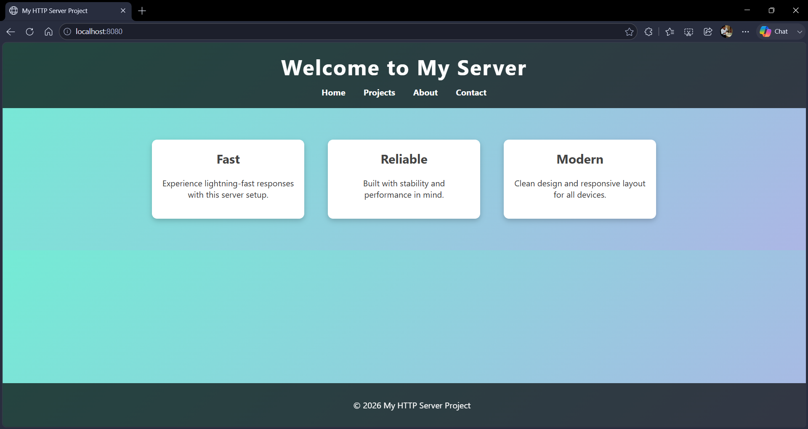
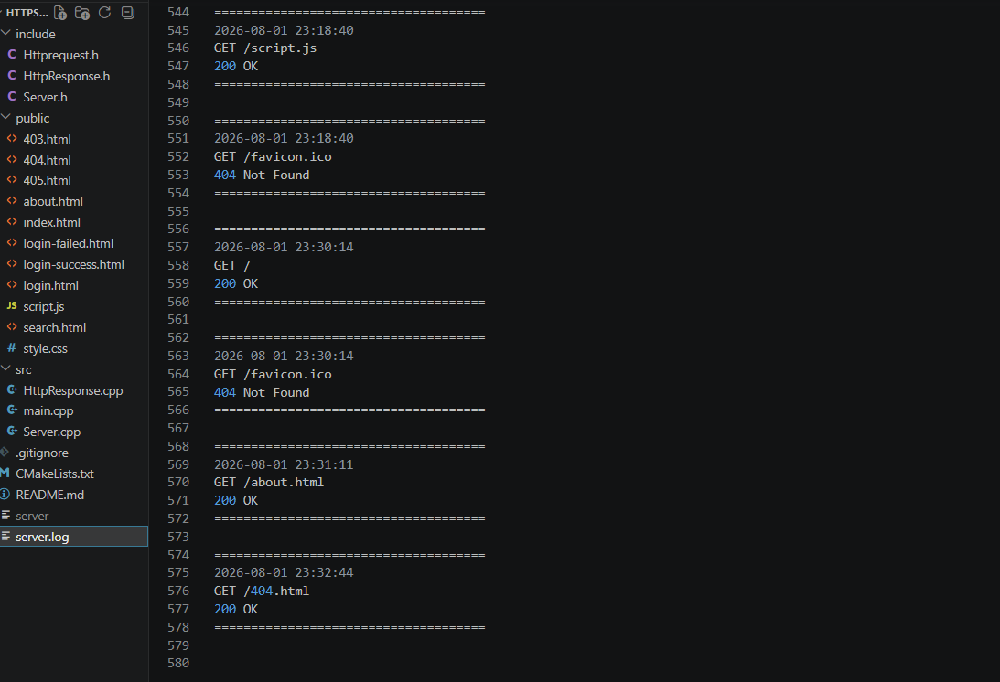
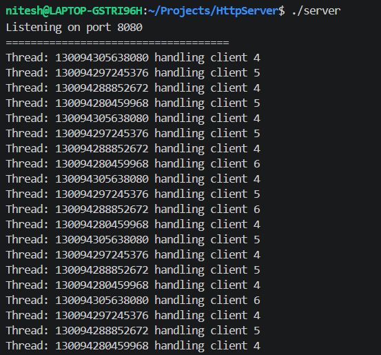

# C++ Multithreaded HTTP Server

A lightweight multithreaded HTTP server built from scratch in C++ using POSIX sockets. The server supports static file serving, HTTP request parsing, routing, MIME type detection, logging, and concurrent client handling using a thread pool.

---

## Features

- HTTP/1.1 request parsing
- Static file serving
- HTML, CSS, JavaScript support
- Image serving (PNG, JPG, GIF, SVG, ICO)
- MIME type detection
- Thread pool for concurrent client handling
- Route handling
- 301/302 redirects
- Query parameter parsing
- Form data parsing
- Custom 404 and 403 error pages
- Request logging
- Directory traversal protection
- Keep-Alive connection support

---

## Project Structure

```
include/
    Server.h
    HttpRequest.h
    HttpResponse.h

src/
    main.cpp
    Server.cpp
    HttpResponse.cpp

public/
    index.html
    about.html
    login.html
    login-success.html
    login-failed.html
    403.html
    404.html
    405.html
    style.css
    script.js
    images/

server.log
```

---

## Build

```bash
g++ -std=c++17 -pthread -Iinclude \
src/main.cpp \
src/Server.cpp \
src/HttpResponse.cpp \
-o server
```

```bash
mkdir build
cd build
cmake ..
cmake --build .
```

---

## Run

```bash
./server
```

Open

```
http://localhost:8080
```

---

## Example Routes

| Route | Description |
|--------|-------------|
| / | Home page |
| /hello | Hello page |
| /server-info | JSON response |
| /redirect | HTTP redirect |

---

## Technologies

- C++17
- POSIX Socket API
- Multithreading
- STL
- File I/O

---

## Future Improvements

- HTTPS support
- Chunked transfer encoding
- File upload support
- HTTP caching
- Configuration file
- Compression (gzip)

---

## Screenshots

### Home Page

The default homepage served by the HTTP server.



### Custom 404 Page

The server returns a custom 404 page when the requested resource is not found.


## 403 Forbidden

Directory traversal attempts are blocked by the server.


## Request Logging

Each HTTP request is logged with timestamp, request path, and response status.



## Concurrent Request Handling

The server uses a thread pool to process multiple client connections concurrently.

